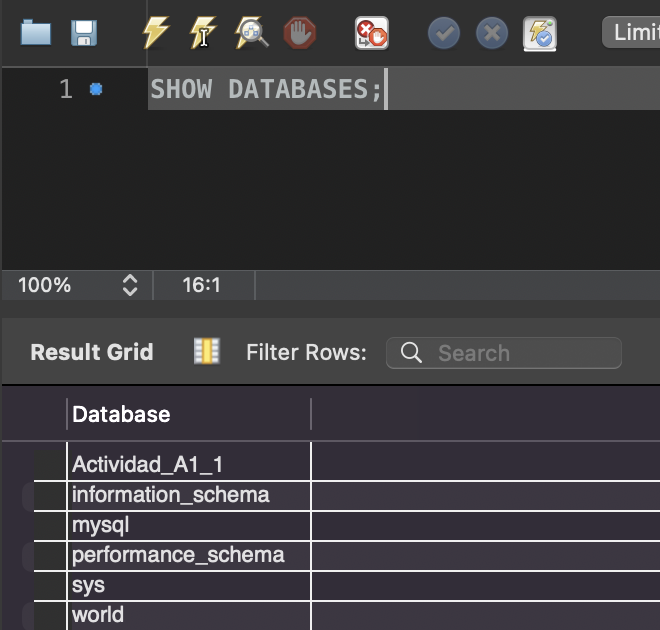
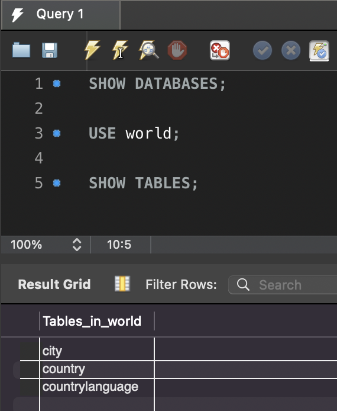
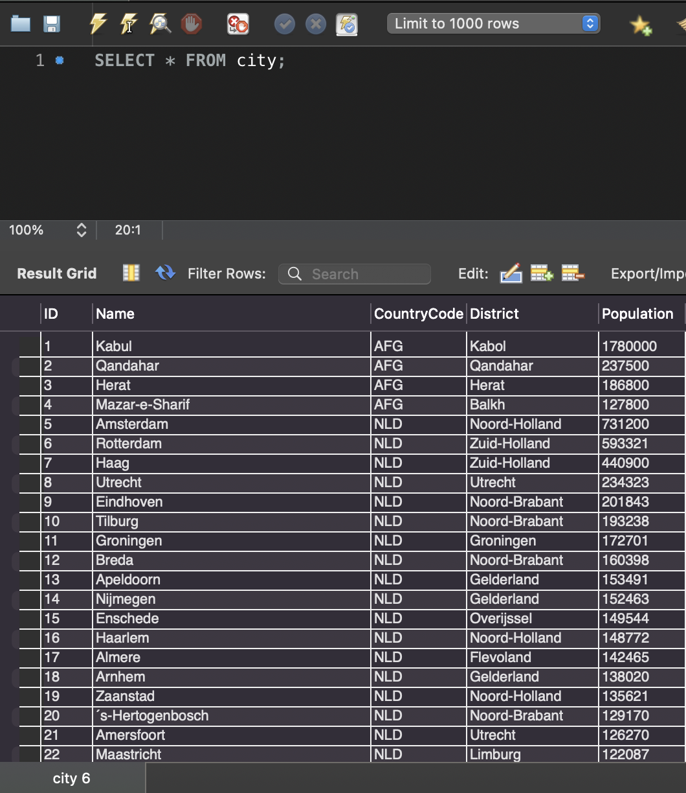
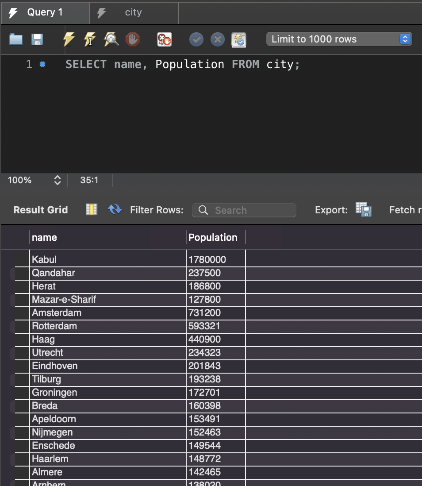
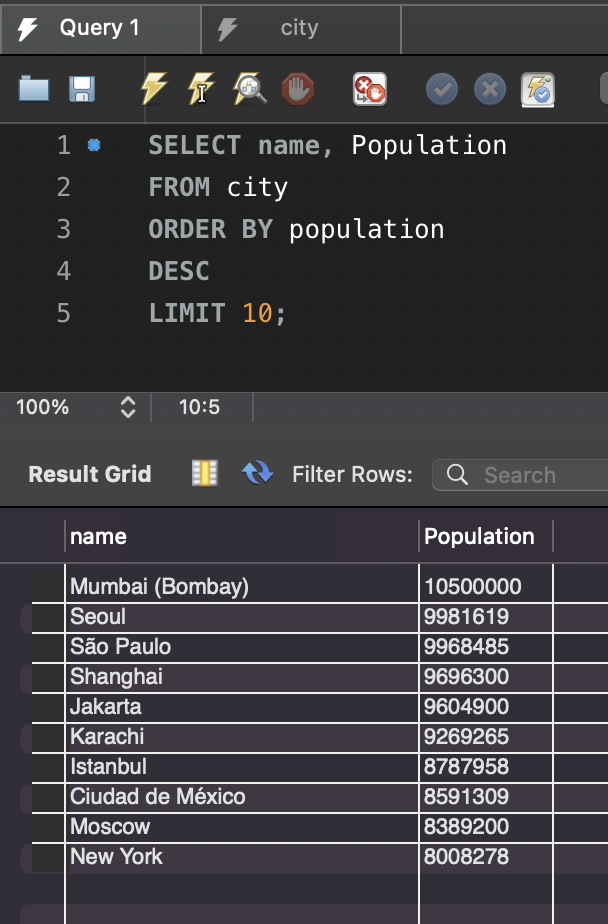

# Actividad 1: Consultas de Bases de Datos Relacionales

## 1. Comandos de configuración

Antes de empezar, cargamos la base de datos `world` y verificamos que las tablas existan.

---

### Comando: `SHOW DATABASES;`
_Este comando nos permite ver todas las bases de datos en el servidor._

```sql
SHOW DATABASES;
```



---

### Comando: `USE world;`
_Seleccionamos la base de datos `world` para poder trabajar con sus tablas._

```sql
USE world;
```
---

### Comando: `SHOW TABLES;`
_Verificamos que las tablas `city`, `country` y `countrylanguage` hayan sido importadas correctamente._

```sql
SHOW TABLES;
```



---

## 2. Consultas sobre la base de datos `world`

### Comando: `SELECT * FROM city;`
_Este comando recupera toda la información de la tabla de ciudades._

```sql
SELECT * FROM city;
```




---

### Comando: `SELECT name, Population FROM city;`
_Este comando recupera los **atributos** de **nombre** y **población** de todas las ciudades de la tabla `city`._

```sql
SELECT name, Population FROM city;
```



---

### Comando: `SELECT, FROM, ORDER BY, DESC, LIMIT`
_Este comando recupera el nombre y la población de las 10 ciudades más pobladas, ordenándolas de forma descendente._

```sql
SELECT name, Population
FROM city
ORDER BY population DESC
LIMIT 10;
```



---