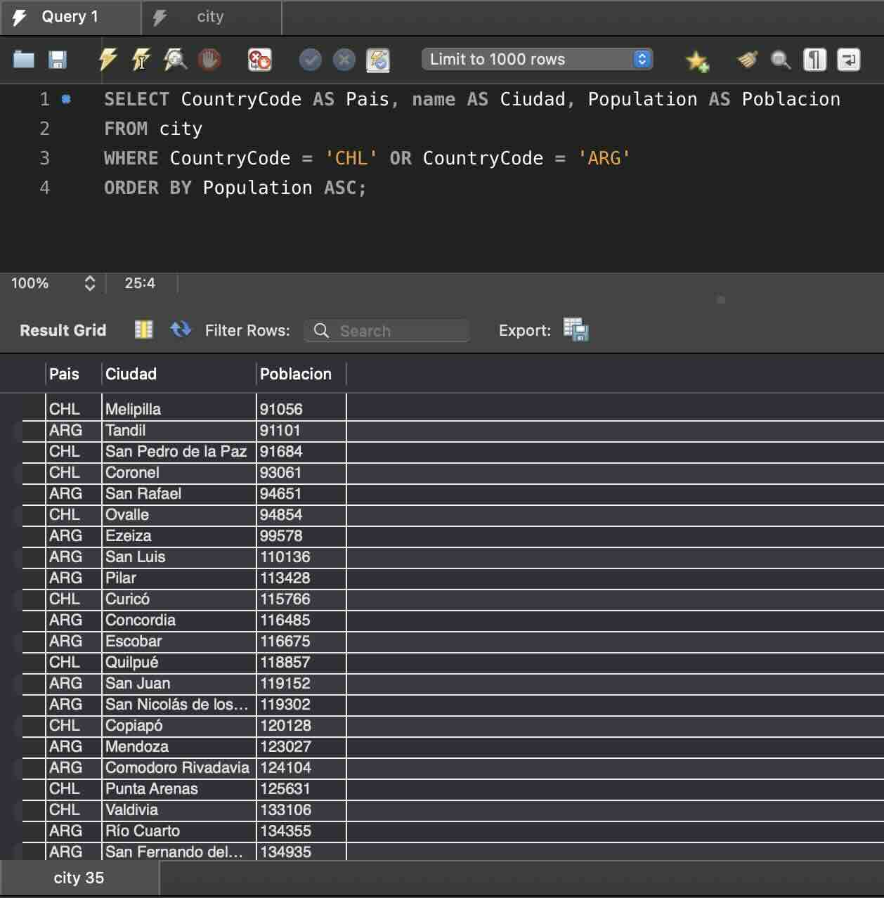

# Actividad 1: Consultas de Bases de Datos Relacionales

## 1. Comandos de configuración

Antes de empezar, cargamos la base de datos `world` y verificamos que las tablas existan.

---

### Comando: `SHOW DATABASES;`
_Este comando nos permite ver todas las bases de datos en el servidor._

```sql
SHOW DATABASES;
```


---

### Comando: `USE world;`
_Seleccionamos la base de datos `world` para poder trabajar con sus tablas._

```sql
USE world;
```
---

### Comando: `SHOW TABLES;`
_Verificamos que las tablas `city`, `country` y `countrylanguage` hayan sido importadas correctamente._

```sql
SHOW TABLES;
```


---

## 2. Consultas sobre la base de datos `world`

### Comando: `SELECT * FROM city;`
_Este comando recupera toda la información de la tabla de ciudades._

```sql
SELECT * FROM city;
```


---

### Comando: `SELECT name, Population FROM city;`
_Este comando recupera los **atributos** de **nombre** y **población** de todas las ciudades de la tabla `city`._

```sql
SELECT name, Population FROM city;
```


---

### Comando: `SELECT name, Population FROM city ORDER BY population DESC LIMIT 10`
_Este comando recupera el nombre y la población de las 10 ciudades más pobladas, ordenándolas de forma descendente._

```sql
SELECT name, Population
FROM city
ORDER BY population DESC
LIMIT 10;
```


---

### Comando: `SELECT name AS Ciudad, Population AS Poblacion FROM city LIMIT 10;`
_Este comando selecciona los atributos de `name` y `population`, pero les da un alias (`AS`) para que se muestren con encabezados más descriptivos (`Ciudad`, `Poblacion`)._

```sql
SELECT name AS Ciudad, Population AS Poblacion
FROM city
LIMIT 10;
```


---

### Comando: `SELECT name AS Ciudad, Population AS Poblacion FROM city WHERE Population > 7000000 ORDER BY Population DESC;`
_Este comando selecciona el nombre y la población de las ciudades, **filtrando** solo aquellas con una población superior a 7,000,000 y ordenando los resultados de mayor a menor._

```sql
SELECT name AS Ciudad, Population AS Poblacion
FROM city
WHERE Population > 7000000
ORDER BY Population DESC;
```


---

### Comando: `SELECT name AS Ciudad, Population AS Poblacion FROM city WHERE Population >= 170000 AND Population <180000 ORDER BY Population DESC;`
_Este comando primero filtra los registros que cumplen la condición dada por la sentencia **WHERE**, luego recupera el nombre y población de todas las ciudades cuya población está entre 170 y 180 mil habitantes. El resultado es ordenado por población de mayor a menor._

```sql
SELECT name AS Ciudad, Population AS Poblacion
FROM city
WHERE Population >= 170000 AND Population <180000
ORDER BY Population DESC;
```


---

### Comando: `SELECT CountryCode AS Pais, name AS Ciudad, Population AS Poblacion FROM city WHERE CountryCode = 'CHL' OR CountryCode = 'ARG' ORDER BY Population ASC;`
_Este comando recupera las ciudades que pertenecen a Chile (`CHL`) o a Argentina (`ARG`), y ordena los resultados por población de menor a mayor._

```sql
SELECT CountryCode AS Pais, name AS Ciudad, Population AS Poblacion
FROM city
WHERE CountryCode = 'CHL' OR CountryCode = 'ARG'
ORDER BY Population ASC;
```



---

### Comando: `SELECT name AS pais FROM country WHERE capital IS null;`
_Este comando selecciona los nombres de los países que no tienen una capital asignada, utilizando la cláusula **`WHERE capital IS null`** para buscar registros con valores nulos._

```sql
SELECT name AS pais
FROM country
WHERE capital IS null;
```


---

### Comando: `SELECT co.name AS pais, co.region, ci.name AS ciudad FROM country co INNER JOIN city ci ON co.code = ci.countrycode WHERE co.name ='Chile' or co.name ='Bolivia';`
_Este comando une las tablas `country` y `city` para mostrar el nombre del país y la ciudad, filtrando solo a Chile y Bolivia._

```sql
SELECT co.name AS pais, co.region, ci.name AS ciudad
FROM country co INNER JOIN city ci ON co.code = ci.countrycode
WHERE co.name ='Chile' or co.name ='Bolivia';
```


---

### Comando: `SELECT co.name AS Pais, cl.language AS Idioma, cl.isofficial AS "Es Oficial", cl.percentage AS Porcentaje FROM country co INNER JOIN countrylanguage cl ON co.code = cl.countrycode WHERE co.region = 'South America'ORDER BY co.name ASC, percentage DESC;`
_Este comando une las tablas `country` y `countrylanguage` para mostrar los idiomas oficiales de los países de Sudamérica, ordenados por país y luego por porcentaje de hablantes._

```sql
SELECT co.name AS Pais, cl.language AS Idioma, cl.isofficial AS "Es Oficial", cl.percentage AS Porcentaje
FROM country co
INNER JOIN countrylanguage cl ON co.code = cl.countrycode
WHERE co.region = 'South America'
ORDER BY co.name ASC, percentage DESC;
```


---

### Comando: `SELECT co.name AS Pais, co.indepyear AS "Año de Independencia", YEAR( NOW() ) - co.indepyear AS "Años" FROM country co WHERE co.region = 'South America' AND co.indepyear IS NOT NULL ORDER BY co.indepyear ASC;`
_Este comando selecciona los países de Sudamérica y calcula cuántos años han pasado desde su independencia, excluyendo aquellos con fechas nulas y ordenando los resultados de forma ascendente._

```sql
SELECT co.name AS Pais, co.indepyear AS "Año de Independencia", YEAR( NOW() ) - co.indepyear AS "Años"
FROM country co
WHERE co.region = 'South America' AND
co.indepyear IS NOT NULL
ORDER BY co.indepyear ASC;
```


---

### Comando: `SELECT co.region AS "Región", sum(co.population) AS "Población" FROM country co GROUP BY co.region ORDER BY 1 ASC;`
_Este comando agrupa a todos los países por su región y suma sus poblaciones para obtener la población total de cada región, ordenando los resultados alfabéticamente._

```sql
SELECT co.region AS "Región", sum(co.population) AS "Población"
FROM country co
GROUP BY co.region
ORDER BY 1 ASC;
```


---

### Comando: `SELECT co.region AS "Región", sum(ci.population) AS "Población" FROM country co INNER JOIN city ci ON co.code = ci.countrycode GROUP BY co.region ORDER BY 1 ASC;`
_Este comando une las tablas de países y ciudades para sumar la población total de las ciudades en cada región, y luego ordena los resultados alfabéticamente por el nombre de la región._

```sql
SELECT co.region AS "Región", sum(ci.population) AS "Población"
FROM country co
INNER JOIN city ci ON co.code = ci.countrycode
GROUP BY co.region
ORDER BY 1 ASC;
```


